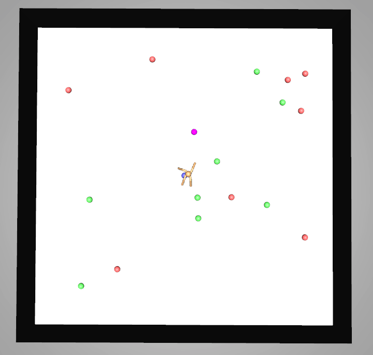
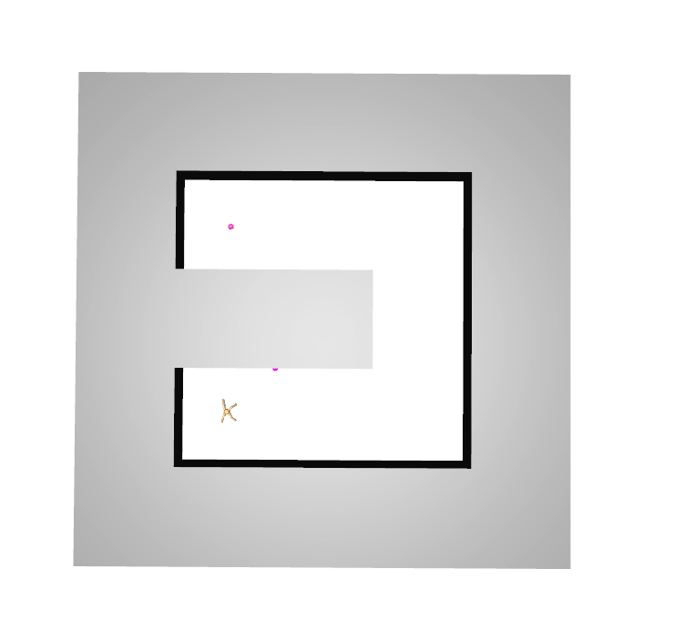
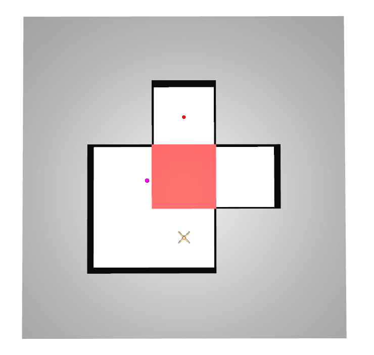

# Scalable hierarchical evolution strategies

This is mostly Julia's wonderful multiple dispatch on top of my [ScalableES](https://github.com/sash-a/ScalableES.jl/) codebase. Most of the structs in here simply hold two of the similar type from ScalableES, one for the controller (c) and another for the primitive (p) for example:

```
mutable struct HrlAdam <: ScalableES.AbstractOptim
    copt::ScalableES.Adam
    popt::ScalableES.Adam

    HrlAdam(cdim::Int, pdim::Int, lr::Real) = new(ScalableES.Adam(cdim, lr), ScalableES.Adam(pdim, lr))
end
```

## How to run

For install instructions see [ScalableES](https://github.com/sash-a/ScalableES.jl/)

```
julia --project -t 8 scripts/runner.jl config/cfg.yml
```

## Examples

Envs that have been trained using this method:

### Ant Gather


### Ant Maze


### Ant Push
